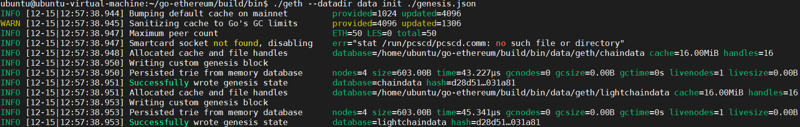
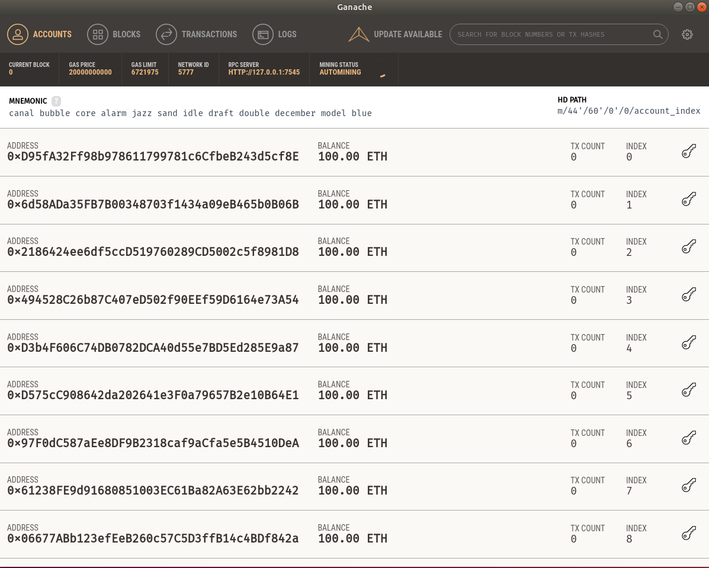
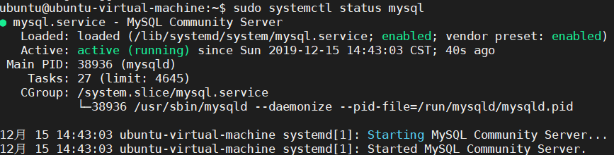

# 系统环境配置

## 操作系统

- 准备一台 **`Ubuntu 18.04`** 操作系统的电脑。

## 运行环境

### 1. 搭建 **`GO`** 语言环境

```
sudo apt install git wget vim gcc g++ ntp
sudo apt install make
sudo apt install make-guile

sudo apt-get remove golang-go

wget https://dl.google.com/go/go1.12.linux-amd64.tar.gz
sudo tar zxvf go1.12.linux-amd64.tar.gz -C /usr/local
rm -r go1.12.linux-amd64.tar.gz

gedit ~/.bashrc
export GOROOT=/usr/local/go
export GOPATH=/home/ubuntu/program_develop/go_demo
export PATH=$PATH:$GOPATH:/usr/local/go/bin
source ~/.bashrc
```

+ **To test go envrionment**
```
go version
```


### 2. 下载 **`ethereum`** 项目源码

```
wget https://github.com/ethereum/go-ethereum/archive/v1.9.1.zip
unzip -qq v1.9.1.zip
rm -r v1.9.1.zip
mv go-ethereum-1.9.1 go-ethereum
cd go-ethereum
make all

su root
echo "export PATH=$PATH:/home/ubuntu/go-ethereum/build/bin" >> /etc/profile
source /etc/profile
su ubuntu
source /etc/profile
source ~/.bashrc
```


### 3. 初始化区块链环境

- 创建创世区块 **`genesis.json`**

```
cd build/bin
gedit genesis.json
```

```JSON
{
	"config": {
		"chainId": 20,
		"homesteadBlock": 0,
		"eip155Block": 0,
		"eip158Block": 0
	},
	"alloc": {
		"bc9a3ece02d7cb31cf63dfdfc48db0b82770d014": {
		"balance": "1000000000000000000000000000000"
		},
	"457e7d69fd3ac576aa744228e6b3319cde768473": {
		"balance": "2000000000000000000000000000000"
		},
	"926ef6011f7c852d30a01c7a4aaa5cbc460588fc": {
		"balance": "3000000000000000000000000000000"
		}
	},
	"nonce": "0x0000000000000056",
	"difficulty": "0x020000",
	"mixhash": "0x0000000000000000000000000000000000000000000000000000000000000000",
	"coinbase": "0x0000000000000000000000000000000000000000",
	"timestamp": "0x00",
	"parentHash": "0x0000000000000000000000000000000000000000000000000000000000000000",
	"extraData": "0x11bbe8db4e347b4e8c937c1c8370e4b5ed33adb3db69cbdb7a38e1e50b1b82fa",
	"gasLimit": "0x4c4b40"
}
```

- 初始化区块链环境

```
mkdir data
./geth --datadir data init ./genesis.json
```



- 运行区块链环境
```
./geth --networkid 15 console
```


### 4. 安装 **`Node.js`**

```
sudo apt install nodejs
sudo apt update
wget https://nodejs.org/dist/v10.15.3/node-v10.15.3.tar.gz
tar xvf node-v10.15.3.tar.gz
rm -r node-v10.15.3.tar.gz

sudo apt install python

cd node-v10.15.3
sudo ./configure
sudo make
sudo make test
sudo make install  
sudo cp /usr/local/bin/node /usr/sbin/
```


### 5. 安装 **`npm`** 和 **`truffle`**

```
sudo apt install npm
sudo npm install -g truffle
```

### 6. 安装 **`ganache`**

```
cd ~
wget https://github.com/trufflesuite/ganache/releases/download/v1.1.0/ganache-1.1.0-x86_64.AppImage
sudo chmod +x ganache-1.1.0-x86_64.AppImage
./ganache-1.1.0-x86_64.AppImage
```



### 7. 安装 **`Solidity`**

```
sudo apt install build-essential checkinstall zlib1g-dev
sudo apt install openssl libssl-dev
sudo apt install cmake
sudo apt install libboost-all-dev
git clone --recursive https://github.com/ethereum/solidity.git
cd solidity
mkdir build
cd build
cmake .. && make
sudo make install
```


### 8. 安装 **`mysql`**

```
cd ~
sudo apt install mysql-server
```

```
sudo systemctl status mysql
```


```
mysql --version
```


```
sudo mysql
ALTER USER 'root'@'localhost' IDENTIFIED WITH mysql_native_password BY 'root';
grant all privileges on *.* to 'root'@'%' identified by 'root' with grant option;
flush privileges;

exit
sudo gedit /etc/mysql/mysql.conf.d/mysqld.cnf

#bind-address = 127.0.0.1
bind-address = 0.0.0.0

sudo /etc/init.d/mysql restart
```

+ **Create database by `CAS.sql`**

## 项目编译运行

### 1. 项目源码下载

```
wget https://github.com/LcxCausal/CertificateAuthorizationSystem/archive/develop.zip
unzip -qq develop.zip
rm -r develop.zip
mv CertificateAuthorizationSystem-develop CertificateAuthorizationSystem
```

### 2. 项目编译

```
cd CertificateAuthorizationSystem
npm install
sudo truffle compile
sudo truffle migrate --reset
```


### 3. 项目运行

```
npm run dev
```


